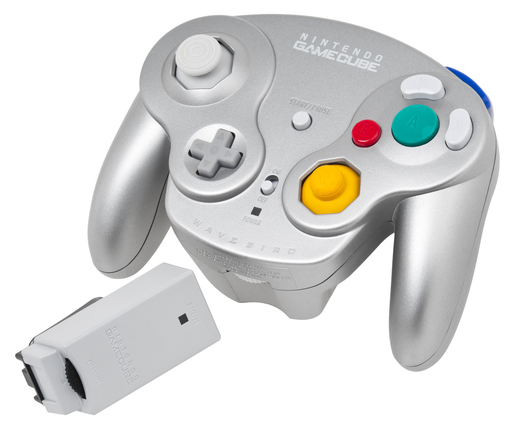

Chapter 0: Observations
=======================

Reverse-engineering is a science. We come up with a guess as to how the device
works, we come up with a way of testing that guess, and we write about what we
learn.

This chapter is called "chapter 0" because we're not actually doing any
reverse-engineering yet. Let's start with what we know and figure out what we
can guess!

WaveBird
--------

This is the WaveBird:

It consists of the controller - the same general shape as a regular
GameCube controller, but slightly bulkier and heavier since it takes 2 AA
batteries - and a receiver which plugs into one the GameCube's controller
ports.

The receiver does not take batteries, so we know it gets its power from the
GameCube directly, via the controller port. The receiver also has a light that
only illuminates when it's receiving input (a pressed button or off-center
axis) from the controller.

Both the controller and receiver have a "channel selector" dial on them, which
lets the user select any number from 1-16. The receiver and controller must be
set to the same channel for the system to work. If multiple WaveBird receivers
are connected, players can set them to different channels and use multiple
WaveBirds at the same time!

Another interesting thing to note is that the WaveBird controller, unlike the
wired controller, does not have rumble capability or indeed any kind of feedback
whatsoever. The controller cannot even confirm to the user that the GameCube is
even on at all! This suggests a one-way link.

The controller has 10 digital buttons, two analog thumbsticks, and two shoulder
buttons with pressure sensors and digital buttons at the end.

Intuition
---------

Let's use our intuition a bit here and put ourselves in the shoes of the
wireless engineer, working at Nintendo circa 2001, trying to solve this problem.

First, we need to know what kind of data we're sending. We have our 12 digital
buttons total - each of those can be represented with a single bit. We also
have our four thumbstick axes (two per thumbstick), and we also send the
positions of the shoulder buttons when those are pressed (as we can see the
indicator light on the receiver illuminate when those are only slightly
pushed).

12 digital buttons, 6 analog axes. If we assume 8 bits per axis, that's about
60 bits of information. Sounds easy enough.

Our wireless engineer was probably told not to worry about rumble support. This
lets him cut costs by not requiring a receiver inside the controller or a
transmitter inside the receiver.

The one-way signal theory is reinforced by the fact that two receivers can be
set to the same channel as one WaveBird controller - effectively _duplicating_
controller input. Some fans of a certain popular fighting game take advantage
of this fact in co-op mode. If a "return" signal was needed for the system to
work, the two receivers would likely both transmit that signal and interfere
with each other, causing the controller to fail.

There's 16 channels, which is interesting for a controller meant for a 4-player
game console. Why do we need 4x as many channels as there are players in the
same room? Perhaps our engineer knew the signal could travel through walls and
wanted to make sure players wouldn't get interfering control inputs from their
next-door neighbors. But that still assumes you've got 4 neighbors all playing
their GameCubes at the same time with 4 players per GameCube and all 16 players
on WaveBirds. Perhaps they wanted to allow in-person gaming tournaments,
perhaps there are other sources of interference besides other WaveBirds.

There's no wire on the WaveBird. How do we get a signal across the room without
a cable? There are a few ways to do it:
- Ultrasonic sound waves
- Light (e.g. infrared remotes, laser links, etc.)
- Radio

Ultrasonic is a very expensive and error-prone technology. It's not likely
Nintendo would have chosen this; but we can be sure by testing the controller
in very loud environments or through walls.

Light/infrared would be a cheaper option. We know it's not visible light simply
because we can look at the controller while it's in operation and not see
anything glowing besides the power LED. Covering that LED doesn't disrupt
gameplay, and indeed covering the entire controller (with, say, a blanket) does
nothing. Also, light/infrared are fickle when the emitter isn't aligned right,
which would make for a frustrating product.

Radio seems like the best option here. It's relatively cheap, works through
obstacles and with the controller not pointed directly at the receiver, and is
fairly easy to use overall. The only drawbacks are that radio is more heavily
regulated than the other options (in the U.S., the spectrum is regulated by the
FCC, and you need a license to transmit on most frequencies) - fortunately,
those regulatory agencies often set aside unlicensed bands that short-range
transmitters may use without agency approval, but that leads to another problem
entirely - because those bands are pure anarchy, there are no guarantees
whatsoever against interference.

A-ha! Suddenly the 16 channel number makes sense. If the controller's working
poorly because of interference on said unlicensed band, the 16 channels give
the user plenty of options for other _frequencies_ on that band to avoid the
interference and keep playing.

The last thing we need to explain is why the receiver's indicator light turns
off when the controller is on but not being used. It could simply be that the
receiver is trying to be helpful in letting players know which inputs
correspond to which receivers, but if we consider that the radio transmitter
takes up valuable battery life, and players may often forget to switch off
their WaveBird controller, it's more likely that our crafty wireless engineer
decided that the WaveBird should only transmit when there's control input, and
the receiver can simply assume "no signal" = "no input"

Hypothesis
----------

We now have our hypothesis for how the WaveBird works:
- It uses radio, in the unlicensed bands (either 902-928 MHz, 2400-2500 MHz, or
  5725-5875 MHz).
- The specific frequency used is selected by the channel wheel.
- The controller transmits the same 60-or-so-bit message on repeat while a
  button is held or axis is moved.
- The receiver uses the most recent valid message as the controller state. If
  it doesn't get a message for a while, it assumes the controller is off or
  in its neutral position.

And a little [background research](https://nintendoworldreport.com/news/8096/mitsubishi-to-supply-24ghz-wavebird-chip)
confirms that the WaveBird is a radio device, which used to run in the 900 MHz
band, but now runs in the 2.4GHz (2400 MHz) band.
