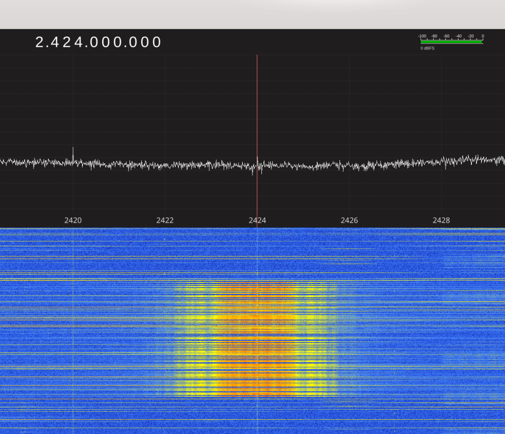

Chapter 1: Frequency
====================

In the previous chapter, we made a guess about how the WaveBird worked. Our
guess is that it transmits a signal somewhere in the 2.4GHz (2400 MHz) range of
radio, when it's on and being given an input, and the specific frequency it
uses is derived solely from the channel selector wheel on the bottom.

To test that out, we need a special tool called a _spectrum analyzer_.

A spectrum analyzer is used to visualize the amount of RF energy present at a
given frequency (or range of frequencies). There are several good options out
there, including very high-end oscilloscope-sized boxes costing upwards of
US$2,000. Personally I prefer to use my trusty [HackRF One](https://greatscottgadgets.com/hackrf/)
from Great Scott Gadgets, its bundled ANT500 antenna, and the open-source
reciever software [Gqrx](http://gqrx.dk/).

Scanning for the right frequency
--------------------------------

This is really pretty easy: Turn on Gqrx, set it to 2400 MHz, press a button
on the controller. If you see something show up, you found the right frequency!
Otherwise, adjust Gqrx upward by a few MHz and repeat.

I happened to have my WaveBird set to channel 7 at the time of doing this, and
while sweeping through the spectrum, made this fantastic discovery:

Looks like channel 7 corresponds to 2424 MHz! Push button, the signal appears,
release button, the signal stops. Great!

The spectrum analyzer does more for us than just identifying the center
frequency - we can also use it to measure the signal's "bandwidth" (not to be
confused with _internet_ bandwidth) - RF bandwidth is how wide of a slice of
spectrum the signal takes up. In this case, the bandwidth appears to be about 2
MHz in either direction, or 4 MHz wide overall.

(As an aside: Pay very close attention to the rippled "fringes" on either side
of the signal. Those will be important later.)

All frequencies used by the WaveBird
------------------------------------

Repeating this process for each channel, we get the following table:

| Channel | Frequency (MHz) |
| ------- | --------------- |
|       1 |         2479.2  |
|       2 |         2474.4  |
|       3 |         2404.8  |
|       4 |         2409.6  |
|       5 |         2419.2  |
|       6 |         2414.4  |
|       7 |         2424.0  |
|       8 |         2428.8  |
|       9 |         2438.4  |
|      10 |         2433.6  |
|      11 |         2445.6  |
|      12 |         2450.4  |
|      13 |         2460.0  |
|      14 |         2455.2  |
|      15 |         2464.8  |
|      16 |         2469.6  |

It's not important to be super precise about the frequency. Thanks to a phenomenon
called [frequency drift](https://en.wikipedia.org/wiki/Frequency_drift),
not even the transmitter will be transmitting on _exactly_ the right frequency.
Unless you're a scientific institution with access to really nice atomic clocks
(for example, [WWV](https://en.wikipedia.org/wiki/WWV_(radio_station)), the
time and frequency station operated by the U.S. Government, broadcasts on
its standard frequencies with perfect precision), it's virtually guaranteed that
imperfections in whatever electronics generate the frequency will be enough to
push you at least a few hundred Hz wide of the mark. And even if the
transmitter is perfect (like in the case of WWV), your receiver can suffer the
same problem.

Radio engineers instead chose to accept that frequency drift is just an
unavoidable fact of life and rather focus on developing ways to cope with the
problem. Later on we'll see how the WaveBird handles frequency drift and clock
skew.

Deriving a frequency from a channel
-----------------------------------

Of course, we wouldn't be very inquisitive reverse-engineers if we didn't take
a swing at how the above table is derived! Let's start by sorting the channels
in ascending order of frequency:

`3, 4, 6, 5, 7, 8, 10, 9, 11, 12, 14, 13, 15, 16, 2, 1`

That's interesting - it looks like 2 and 1 are at the very top (perhaps the
physical channel-selection wheel was installed 2 places rotated?) and every
_other_ pair of numbers is swapped.

Subtracting 3 (mod 16) from everything puts everything in mostly-sorted order:

`0, 1, 3, 2, 4, 5, 7, 6, 8, 9, 11, 10, 12, 13, 15, 14`

The second pattern - every odd _pair_ has the odd and even _number_ swapped,
can be reordered by XORing the 2s bit of the channel number into the 1s bit:

`0, 1, 2, 3, 4, 5, 6, 7, 8, 9, 10, 11, 12, 13, 14, 15`

There we go! Nice and sorted!

Now let's look at the frequencies themselves, again in ascending order:

`2404.8, 2409.6, 2414.4, 2419.2, 2424.0, 2428.8, 2433.6, 2438.4, 2445.6, 2450.4, 2455.2, 2460.0, 2464.8, 2469.6, 2474.4, 2479.2`

Looks like each frequency is 4.8 MHz above the last, except for the jump from
2438.4 MHz to 2445.6 MHz, which is 7.2 MHz. That's incidentally also the 8th
frequency above the first. So it looks like the first 8 channels are 4.8 MHz
apart, the 8th and 9th are 7.2 MHz (1.5 steps), and then everything else
continues with the half-separation added in.

So it looks like the algorithm to derive a frequency from a channel is:
1. Take the channel number (1-16) and subtract 3, modulo 16.
2. XOR the 2s bit into the 1s bit.
3. If the number is 8 or above, add half.
4. Multiply by the channel separation of 4.8 MHz, and add the base frequency of
   2404.8 MHz

Or, if you prefer it in Python:

    def wavebird_freq(chan):
        assert isinstance(chan,int) and 1 <= chan <= 16
        chan -= 3
        chan &= 0xF
        chan ^= bool(chan & 2)
        if chan&8: chan += 0.5
        return chan * 4.8 + 2404.8

What we just did
----------------

Well, we found the signal! It's definitely radio, and we also know how the
WaveBird derives its center frequency from the channel-selection dial.

Coming up, we'll take a look at how to capture and analyze the radio signal.
But first, we need to learn a little bit about radio theory...
