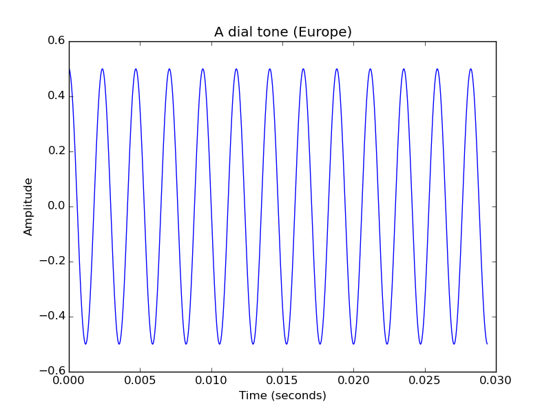
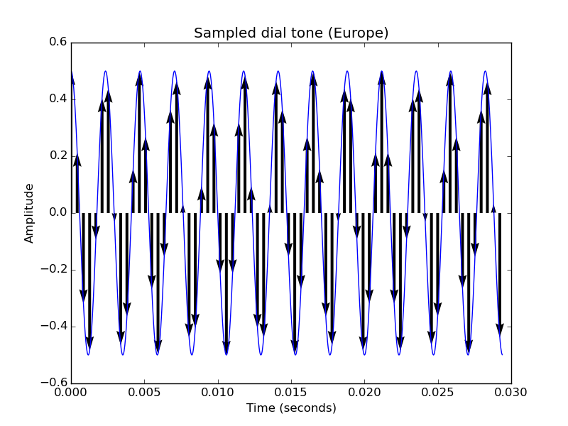
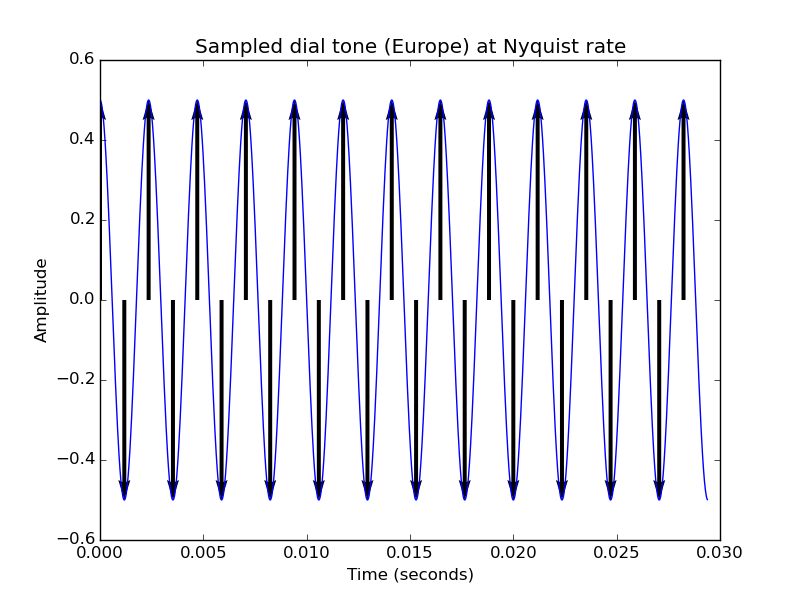
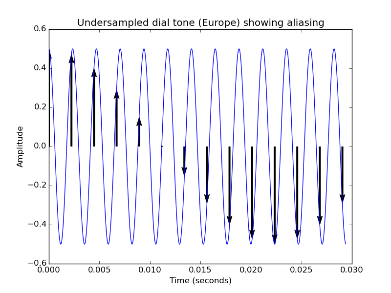

Chapter 2: Signals and Sampling
===============================

**Hey! This chapter really has nothing to do with the WaveBird in particular.**
If you already know your digital signal processing (DSP) and/or software-defined
radio (SDR), you might just want to skip ahead. This is just an aside to help us
prepare for what's yet to come.

This chapter is written at a _very_ beginner level. Please understand, dear
reader, that I'm not trying to patronize you, but because these concepts get
kinda complex kinda fast, it's very important to make sure we're on the same page.
(That, and I had to learn all of this stuff the hard way, so I'm sorta writing
this as "the document I wish I had when I first started playing with radio")

Signals
-------

If you ask a professor or scientist to define "signal", they'd probably give
you some textbook definition like "[A signal is a function that conveys
information about the behavior of a system or attributes of some
phenomenon](https://books.google.com/books?id=QBT7nP7zTLgC&pg=PA1#v=onepage&q&f=false)"

This is true, but quickly approaches meaninglessness because it uses so many
big and abstract words. (If you said this in a job interview, they'd say
"Okay... but what's a 'function'?") So to put this in more layman's terms, I'd
like to define a signal like this:

**A signal is anything that conveys information by varying over time.**

Which means the blinking "charge" light on your cell phone is a signal. The
cycling lights at an intersection are a _traffic signal_. When you yell down
the hall at your roommate who forgot to clean the dishes for the third time
this week, you are conveying your displeasure through an _auditory signal_.
Even smoke signals sent by tribes indigenous to North America count because the
position on the hill the smoke came from carried the message. 

Waves
-----

Most signals are actually _waves_. This is because the back-and-forth action of
waves allows them to keep spreading out over a further distance than
_currents_. If you're swimming in a pool, you can't splash your friend on the
other side, but you can send a wave that'll make it all the way across the pool
(and possibly even back!) more easily. If you're indoors and want to try a quick
experiment, try standing 10 paces away from a volunteer and try blowing air at
them. Odds are they won't feel it. But if you try _whistling_ instead, they'll
be able to detect that. Currents transfer their energy away to other particles
and _dissipate_. Waves transfer their energy away to other particles and _propagate_.

(As an aside: This is why the electricity outlets in your building run on
_alternating current_ instead of _direct current_ - alternating current is
actually sent down the power lines as a wave, so the electricity itself doesn't
have to move over long distances, only the push-and-pull action of the AC.)

Waves have two main attributes:
- _Amplitude_, which is how "big" the wave is.
- _Frequency_, which is how quickly the wave is cycling.

The energy of the wave is some function of its amplitude and its frequency, but
as a wave spreads out, it tends to lose amplitude and keep the same frequency,
which is why the further away from a music speaker you get, the quieter the
music sounds, even though it has the same pitch.

The inverse of frequency ("how often per second does it repeat?") is called
_period_ ("how many seconds is it between repeats?"), but for a moving wave,
scientists prefer to talk about _wavelength_ ("how far does it move in one
cycle?" i.e. "how far does it move per period?") - there are some interesting
physics tricks you can do with wavelength, but for the most part we won't be
talking about it.

Waves go in cycles, and we call the part of the cycle a wave is in its _phase_.
We measure phase in angles (generally degrees, sometimes radians), where 0° is
where the cycle starts over. (Think of it like a clock: 0° - the top of the
clock - is midnight, where the cycle starts over. 90° is a quarter of the way
into its cycle, 180° is halfway, etc.)

Generally, because phase is changing constantly, we use phase comparatively. As
in, "these two waves are 90° out of phase from each other" and not "the wave
starts at a phase of 270°"

Let's look at a signal!
-----------------------

Alright, so we know what signals and waves are. Let's actually look at one!

This is what most of Europe uses as its dial tone (the UK uses the same sound
as the Americas). Let's test your knowledge: What's its amplitude? Its period?
Its frequency?

Sampling: How digital computers see signals
-------------------------------------------

This is great and all, but we're doing this on the computer, and computers
don't see time continuously. They think in terms of _discrete_ steps.

Let's put it another way. Suppose you're hired down by the ocean to make a
plot of the tidal patterns over the course of a month. Are you _really_ going
to just sit on the pier and constantly watch the water level? No, instead you'd
go down every hour or two, check the current water level, and record it on your
chart.

This is called [sampling](https://en.wikipedia.org/wiki/Sampling_(signal_processing)).

When a computer needs to record a signal (say, a sound recording), it _samples_
the signal a few thousand times per second. When it needs to play back the
signal, it just repeats those same samples with the same rate.

Now that we know the position of the wave at a fixed time interval, we can
simply store those levels in a table - or, say, a .wav file. (If you want to
see samples with your own eyes, open up any sound file in something like
Audacity and zoom in until you see individual dots on the waveform.)

How fast do we have to sample?
------------------------------

According to the [Nyquist-Shannon sampling theorem](https://en.wikipedia.org/wiki/Nyquist%E2%80%93Shannon_sampling_theorem),
to sample a signal accurately you must sample at a rate of at **at least twice
the frequency of the highest-frequency component of the signal**. Intuitively
this makes sense: you need a sample for the high part and a sample for the low
part of the wave. This rate is known as the _Nyquist rate_ (Shannon doesn't get
his name on it, but that's probably fair because he's done _a lot_ of other
stuff).

Conversely, the highest frequency that can be represented by a given sampling
rate is half of the sampling rate. This is known as the _Nyquist frequency_.
The Nyquist frequency is an inviolable limit: you cannot represent a frequency
any higher with sampling because you break the "one high, one low" pattern. If
you try, you get something called _aliasing_. Let's look at what happens to our
dial tone if we don't sample it fast enough:

By lowering our sampling rate, we also lowered the Nyquist frequency, and
because we were not wise enough to heed his warnings, we've been inflicted with
the Curse of Nyquist: our sampled wave is now _about 1/19th_ of its original
frequency!

If you're curious about the math, it works like this: for every Hz you exceed
the Nyquist frequency, your alias is one Hz below the frequency. This is a 425
Hz signal sampled at about 447 Hz, which makes the Nyquist frequency about 223
Hz. We're violating Nyquist's limit by 425-223=202Hz, and so we get an alias at
223-202=21Hz. Ouch.

What we just did
----------------

Again, this was a learning chapter. Hopefully nothing in here is too new or
confusing. You're still feeling some uncertainty, feel free to look up sampling
on YouTube - there are a few good videos out there that may visualize it
better. Take a breather and make sure you're comfortable with these concepts,
and when you're ready, click on over to chapter 3 and we'll kick it up a notch.
