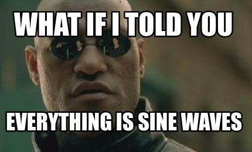
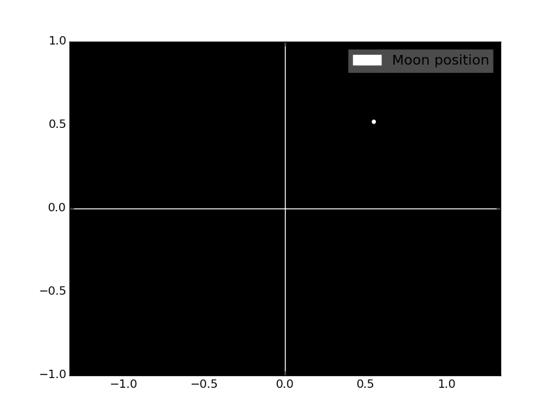
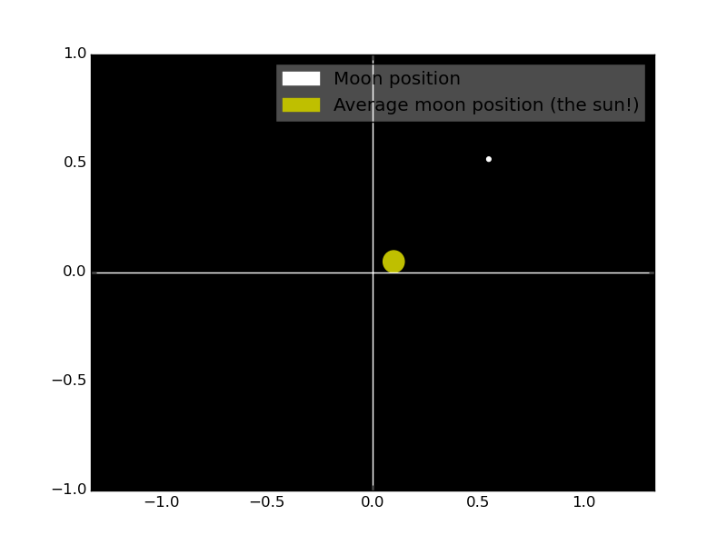
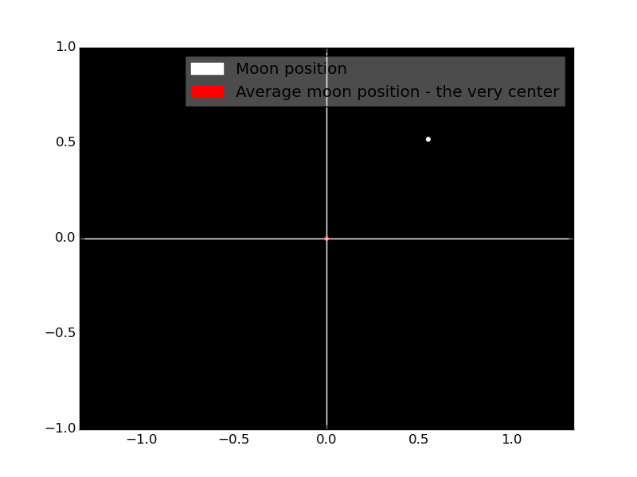
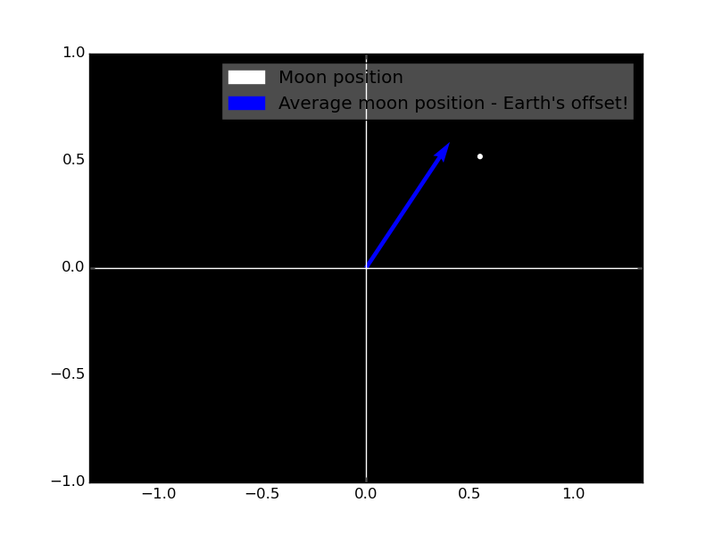
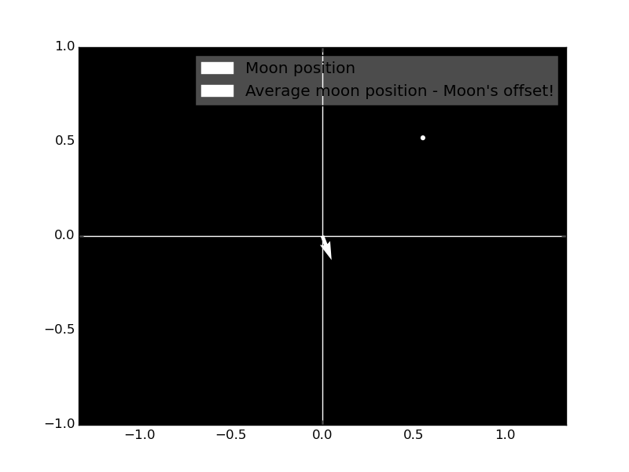
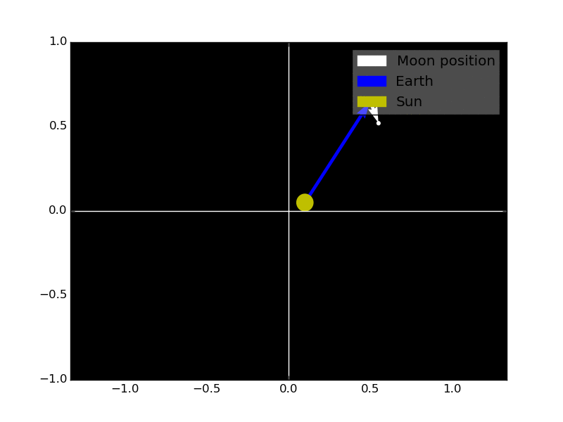
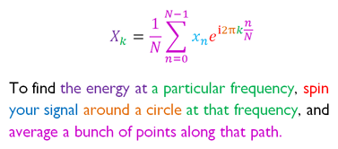
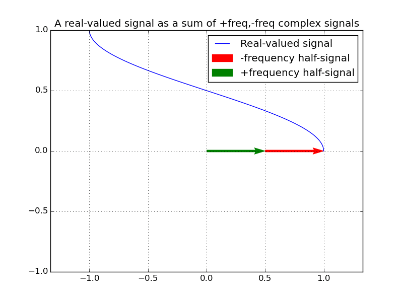

Chapter 3: Complex Signals and Fourier
======================================

**Hey! This chapter has nothing to do with the WaveBird either.**
This is another "learning" chapter, expanding on the knowledge from chapter 2.
Again, you can skip ahead if you're comfortable with the topic.

When I said in chapter 2 that this was about to get complex, I wasn't kidding.
Most signal processing doesn't work on the numbers you're used to in day-to-day
life, but use what are called "complex numbers" - so let's start by exploring
those:

Complex numbers
---------------

Those of you holding your breath right now can relax. "Complex" in this context
does not mean "complicated" (I swear, the mathematicians only chose this word
because they wanted to brag about doing "complex math" at parties) but instead
means "compound" - it's basically a 2D number.

If you're familiar with vectors, they're actually pretty similar. You can
rotate them, multiply them, add them, and so on.

Actually, I was going to write up a whole explanation about how these things
work, but [Kalid Azad's article over at BetterExplained](https://betterexplained.com/articles/a-visual-intuitive-guide-to-imaginary-numbers/) 
does such an amazing job that no matter what I write here I'd be put to shame.

He also explains how [complex number arithmetic](https://betterexplained.com/articles/intuitive-arithmetic-with-complex-numbers/)
works, but really it's just multiplication and conjugation you have to know for
this.

So go ahead and read those. I'll wait.

...

...

Back so soon? Great! In case you didn't take notes, don't worry, you can copy
off mine:

* Numbers are 2-dimensional.
* Multiplying by a complex number rotates by its angle.
* Like negative numbers modeling flipping, imaginary numbers can model anything
  that rotates between two dimensions “X” and “Y”. Or anything with a cyclic,
  circular relationship.
* The conjugate or “imaginary reflection” has the same magnitude, but the opposite angle!

Why we need complex numbers in signal processing
------------------------------------------------

"Great," you're thinking, "my head hurts from having to spread the number line
into a plane, and this really has nothing to do with anything talked about in
the last chapter. Who cares if there's imaginary numbers? How does that help
anyone trying to capture a wave in a computer???"

Well, let's first talk about the problem they solve:

Last time we were talking about (co)sine waves, and you might be familiar with
the (co)sine function as giving the location of a point on the unit circle,
given its angle from the center. Put another way: a sine and cosine are in a
constant, cyclic, *rotational* dance around each other, "orbiting" the zero
point.

If you prefer a physics analogy: any time you see "simple harmonic motion"
of an oscillating object (which you can see, so it's *real*), there's a hidden
(ahem, *imaginary*) inertia causing it to keep moving past equilibrium. A
pendulum is always trying to fall to its center/lowest point, but when it gets
there, its inertia carries it forward and up the other side, and the process
repeats. The same is true of springs, or roller coasters, or whatever: the
position and inertia are in a constant dance around one another, one of them
occasionally becoming zero, but never both of them becoming zero at the same
time. The energy doesn't disappear, it just converts back-and-forth between two
forms. Or dimensions on the complex plane.

(In case you're curious about radio waves, they're actually made up of an
electric field and a magnetic field, and the energy's shifting back and forth
between those two fields.)

And if you take a picture of (i.e. *sample*) a pendulum's position, you're
losing some information (namely, how fast the pendulum is swinging at the moment).
What if you took the picture right when the pendulum was centered? Anybody
looking at the picture would think the clock is stopped! Even if you took a
picture of a pendulum at the end of its swing, how would anybody know it's
really at the end of its swing and not still moving further?

Someone wanting to compute the total energy of the pendulum would need to know
not just its position in a given moment, but its speed at that moment as well.
One way to capture that would be to take a video (which, say it with me now,
*samples the pendulum at a rate of about 24 FPS*... and that's not an analogy,
by the way - frames in a video are bona fide samples). But, when you think about
it, that's just a roundabout way of getting what we want: how fast is it
moving? It'd really be better to *have* that information for each frame (I
mean, sample) so you don't have to look at the surrounding frames and try to
figure it out.

Complex-valued samples
----------------------

We have these problems because we're used to real-valued samples, which only
capture the real value (e.g. position) at a given moment - but we're missing
half of the story. The other half comes from the imaginary component, which
represents the energy in the system *not* due to its position (e.g. velocity).

When we plot them both out, we get something really cool:

In this figure (which I'm shamelessly hotlinking from Wikipedia), you can see a
weight hanging from a spring, bouncing up and down. The position and velocity
are plotted against each other, on different dimensions, and we see that the
harmonic motion of the spring is *literally circular*. The green dot on the
right traces out the full path of the weight (both real and imaginary) before
coming full circle (ha!) and starting over. This green dot is what's known as
a "phase vector", or "phasor" for short - they're pretty useful as long as it's
not against Borg.

(Note: In the above, the plot axes were swapped to match up with the
spring animation - usually the real part is left-to-right and the imaginary part
is bottom-to-top, so just... tilt your head to the left or something.)

The total energy of the spring is represented by the radius of the circle. This
spring is undampened (bouncing without any friction) so it never loses energy,
but in the real world the radius of the circle would slowly decrease as energy
is lost, spiraling inward until the spring sits still - right in the very center
of the circle.

This brings us to the first advantage of complex samples: **The whole energy of
the wave is preserved at all times.** Only the phase, not the magnitude,
changes.

Also, unlike a basic back-and-forth motion, a circular motion has "direction" -
clockwise or counter-clockwise. This means the motion can be going either
forward or backwards (as in the case of, say, the wheels on the bus going 'round
and 'round). It makes no sense for something back-and-forth to be going
"backwards" (fun social experiment: next time someone waves to you, tell them
they're waving backwards and see how they react). This means that, unlike
real-valued signals, **in the complex domain it's possible to have negative
frequency.**

Because multiplying by a complex number rotates by its angle, multiplying by a
complex number rotating of a certain speed adds that frequency. Put another
way, **multiplying complex signals together sums their frequencies**.

The final advantage of complex signals is that they're not fundamentally
different from a real-valued signal. The real component is still there, just
with an extra bit of information added. **If you decide you want to go back to
real space, just delete the imaginary component.** Although you lose the
benefits of complex phasors if you do this.

What about what isn't a single sine wave?
-----------------------------------------

So all of this should make pretty good sense for just *one* sine wave. That's
great, but I'm sure you're wondering:

1. What about multiple waves added together?
2. What about things that aren't sine waves? Triangle/sawtooth/square/etc waves
   are a thing too, you know!

We'll get to #1 in a moment, but for #2...

And in case I wasn't clear what I meant by "everything" - I mean *everything*.
Triangle waves, square waves, the speed of my car (as a function of time)
during my morning commute to work, the contour of the mountain range outside my
driver-side window, *the entirety of Beethoven's Fifth* freaking *Symphony*...

(And if you wanna be really literal about "everything" you can: because of the
fact that [every particle in our universe is also a
wave](https://en.wikipedia.org/wiki/Wave%E2%80%93particle_duality), even
physical objects are made up of sine waves: your computer, your chair, *you*...
spacetime is a weird place.)

Don't take my word for it. There's a script in this directory (synthesize.py)
which uses nothing but Python's `math.cos` function to generate an entire audio
file. Run it, listen to the output, and you should hear a familiar voice.

...

At this point I hope you're convinced that #2 isn't an issue - if we solve the
"multiple sine waves" problem, we solve the "everything else" problem. If you'd
prefer to *see* rather than *hear* what's happening, refer to [this animation
to see how a square wave is built out of sine waves](https://upload.wikimedia.org/wikipedia/commons/1/1a/Fourier_series_square_wave_circles_animation.gif).

In particular it's important to note that, in our physical world, there's
actually **no such thing as a square wave**. It's not only impossible to jump
instantly between high and low states without overshooting, the universe
really has no concept of a sudden change either - only "very high frequencies"

Also, since a square wave is made up of a (potentially infinite) series of sine
waves, all at equally-spaced intervals, it has a *very* distinctive shape on a
spectrum analyzer. (Remember chapter 1 when I said to pay attention to the
rippled fringes?)

Another fun fact: There's a common joke on YouTube comment threads for 8-bit
remixes of songs that goes something like, "Set it to 240p quality for REAL
8-bit sound!" - contrary to popular belief, this is actually backwards. Using
more aggressive audio compression will actually *remove* many of the
higher-frequency components of the square waves that give 8-bit music its
characteristic sound, and will instead result in most of the music sounding
more sine-y. If you want to preserve the square waves and triangle waves in all
their sharp-edged glory, use the highest quality setting you can.

Fourier
-------

By now I'm sure you're wondering what weird magic lets you split any function
into sines. Well, you're in luck, because a mathemagician always reveals their
secrets. It all starts with this guy:

This man, pictured above looking unamused with the speed of whoever's painting
his portrait, is *Joseph Fourier* (pronounced "FOO-yeh"). He was not a signal
processing expert; he studied heat transfer (and is widely credited as the
discoverer of the greenhouse effect). However, while he was studying heat, he
made an interesting discovery: It's easier to analyze heat patterns if you
split them up as a sum of sines. To that end, he claimed (mostly correctly;
there are a few exceptions) that any function of a variable can be exactly
expanded as an infinite series of a sum of sines (with each varying by
frequency, phase, and amplitude).

This kicked off an entirely new branch of mathematics, named (in his honor)
*Fourier analysis*. The magic of Fourier analysis works like this: Because any
function can be expressed in the "time" domain (which is what we've been doing so
far: taking samples at a fixed rate in sequence) or the "frequency" domain (the
table in the `synthesize.py` script, for example), we can freely switch back
and forth between the two views based on whichever is easier to use at the time.

The applications of this are extensive:
* Want to build an audio equalizer? Go to the frequency domain, apply whatever
  adjustments are necessary, then go back to the time domain.
* Want to identify a chord in music? Take the sound into the frequency domain
  and look for the peaks in the frequency spectrum.
* Want to measure Doppler shift in a sonar? Fire off a ping of a known sound,
  record the sound of its reflection, take that into the frequency domain, and
  look for the peak.
* Want to filter out high frequencies so you can lower a sample rate without
  suffering aliasing? Take the signal into the frequency domain, axe out the
  frequencies beyond the Nyquist frequency, go back into the time domain, and
  lower the sampling rate.
* Lightning [emits radio waves of several frequencies](https://en.wikipedia.org/wiki/Whistler_(radio)), and the lower frequencies
  move slower. Want your radio lightning detector to figure out how far away
  the lightning strike was? Take the whole signal into the frequency domain and
  look at how much later the low frequencies arrive after the high frequencies.

In general, any time you need to identify frequencies, Fourier methods are your
go-to branch of mathematics.

The algorithm that does this conversion is called a *Fourier transform*. If you
have a collection of samples, you can throw them through the Fourier transform
and get back an array of phasors for each frequency. (Actually, you don't want
to use the Fourier transform, because that works on continuous functions. If
you have an array of samples, you want to use the *discrete* Fourier transform.
(Actually, you don't want that either, because it's pretty slow. You probably
want to use the aptly-named *fast* Fourier transform, which does the same
thing, *and* requires less computation.))

How the Fourier transform works
-------------------------------

Suppose we have a model of a solar system. There's the moon, and it orbits the
Earth, and the Earth orbits our sun, which itself does not move (but isn't
necessarily at the center of the model). We'll also say that the lights are off
and the only thing we can see is the moon:

If all you know is the position of the moon, how do you find the position of
the sun? Simple: Take enough samples of the moon's position over a long enough
timespan and average them together - all of the periodic components (the Earth
orbit and moon oribt) will cancel each other out and whatever remains is the
fixed position of the sun!

Good? Good.

Now let's suppose we take the whole model and plop it down on a turntable to
spin it at some arbitrary speed. This means the sun is now orbiting the center
of the model, the Earth's orbital speed (relative to us, the observers) is
sped up by the model spinning, and the moon's orbital speed (likewise
relative to us) is also affected by the same.

If we just spun the model at some arbitrary speed, odds are we'll see an average
moon position of (0,0) because there'll be no more fixed components to the
moon's position. We changed the oribital speeds of the Earth and moon, and now
the sun has an orbital speed (relative to the center of the model) as well.
When we average it all out, it all cancels out to zero.

But what if, by chance, our spinning frequency is the negative of the Earth's
frequency? Now the only "fixed" position in the model is the Earth's offset
from the sun, since that's the only thing being canceled out. Our average will
tell us the planet's radius (from the sun) and initial angle
(when we turned on the turntable). The planet's speed was canceled out and
became 0. The sun and moon are nonzero and hence periodic and thus cancel each
other out.

And you can guess what happens if we set the turntable to cancel out the
movement of the moon (but not the sun and planet).

This is what the Fourier transform is all about: over a long enough time, the
periodic components will cancel each other out, so if you want to find out how
much energy is at a particular frequency, you just need to spin the signal the
other way around so that it cancels out *only that particular frequency and
makes everything else periodic*. Then you average.

We can use what we learned from our Fourier analysis of the moon's position in
the dark, and put it all together to reconstruct the full solar system model:

Yes, that makes the Fourier transform essentially a guess-and-check method.
You have to know what frequency you're testing for before you perform any
computation, which means if you use your favorite programming language's math
library to compute a Fourier transform, it's doing this for a bunch of
frequencies at once - but a good Fourier implementation can do this very fast.

Stuart Riffle over at
[AltDevBlogADay](http://altdevblogaday.com/2011/05/17/understanding-the-fourier-transform/)
produced this fantastic graphic which explains the DFT equation itself in terms
of spinning and averaging:

(He clarifies that this isn't the *exact* same equation as what'll appear in
your mathematics textbook because he changed some terms for clarity. But if you
understand this equation, you pretty much get it.)

What about real-valued signals?
-------------------------------

One way to construct a real-valued signal is as a pair of complex signals, each
with opposite frequency, and each with half of the amplitude of the whole:

Their real-valued components are always lined up and work together, while their
imaginary-valued components are always in opposition and cancel out. The result
is a wave that never leaves the real number line!

One of my favorite things about mathematics is just how symmetrical it is. If
you can construct a function some way, you can deconstruct it the same way. We
built a real-valued wave out of 1/2-amplitude complex waves, so what do you
think Mr. Fourier sees when it comes time to take it apart into its base
components? Half of the energy will be at the positive frequency, and half of
the energy will be at the negative frequency.

In fact, the word "complex" is really unfortunate, because it's the real-valued
signals that are the artificial constructs. The complex signals are the real
fundamental building blocks here.

So how do you _make_ a complex signal from a real one?
------------------------------------------------------

Since a complex signal is actually the more fundamental of the two, the
question should actually be, "How do you remove the negative-frequency half of
the real signal?"

Looking at the animation above, and seeing that the green arrow (the positive
frequency component) is what we want when we ask for the complex-valued version
of the (blue) real-valued signal, the answer is clear: Delete the red
component, and double the green.

So if you have a real signal and you want it in the complex world, you just
take it into the frequency domain with the Fourier transform, wipe out all of
the negative frequencies, double all of the positive frequencies, and take it
back into the time domain with the inverse Fourier transform. The result is a
signal with the exact same real component, but you've recovered the missing
imaginary component.

(Or, if you want to be efficient here, just use the [Hilbert transform](https://en.wikipedia.org/wiki/Hilbert_transform),
which will tell you the missing imaginary component directly.)

Software-defined radio (SDR)
----------------------------

Just like how music is going digital, with synthesizers and audio effects and
mixing done in software and a soundcard to convert it to an analog sound wave
at the very end, radio technology is also going digital. We can implement the
filters and demodulators and decoders in software, and then the hardware is
just a box that digitizes the raw radio signal.

The HackRF One, which I'm using, is one such example of an *SDR* -
or as I like to think of it, a "soundcard but for radio," since they're really
extremely similar devices, just with a few key differences.

A soundcard and SDR both work by sampling a signal (either one it's
playing/transmitting, or one it's recording/receiving) at a fixed sample rate
and transferring the samples to/from a computer which handles further
processing in software.

One key difference is that a soundcard typically only samples at about 48,000
samples per second (enough to capture/playback a 24KHz audio wave, which is
around the limit of what the human ear can hear anyway). An SDR, on
the other hand, typically operates in the range of millions of samples per
second (so it can operate on radio waves up to the MHz range).

The HackRF One, for example, goes up to about 20 Msps (20 million samples per
second), which is enough to allow capture/playback of up to a 10MHz radio wave.
While this is great for AM/shortwave, trying to operate in the higher-frequency
bands is impossible... without a little help.

This leads us to our final key difference between soundcards and SDRs: an SDR
contains a programmable tuner which can shift frequencies between the desired
RF signal and a "baseband" signal which is low-frequency enough to be sampled.

How does the tuner work? As I said above, multiplying complex signals together
sums their frequencies. So all the tuner has to do is generate a complex wave
and multiply the samples by that wave. For transmit, it uses a
positive-frequency wave to shift the low-frequency baseband **up** to the RF
band. For receive, it uses a negative-frequency wave to shift the RF **down**
to the baseband. The multiplication itself is performed in hardware, using a
device called a "mixer" - a special kind of amplifier that multiplies voltage.
(In reality, doing complex multiplication in analog hardware isn't *quite* that
easy, and sometimes there are a few stages, but conceptually that's how it works.)

And this is why the samples in an SDR are complex-valued, because as I said
above, complex waves can have *positive or negative frequency*. So when you're
operating at baseband, it's possible to tell the original frequency of a wave
when it was still at RF frequencies: negative frequencies are below the tuner
frequency, positive frequencies are above.

What we just did
----------------

Again, this was another learning chapter, where we spun a lot of stuff around,
all hopefully without making *your* head spin.

At this point we should be comfortable with the methods necessary to figure out
the frequency (or frequencies) present in a wave. We should also know that
everything is made up of sine waves, and in particular that **square waves
don't exist** (they're actually made up of sine waves spaced along in a certain
easy-to-spot pattern).
