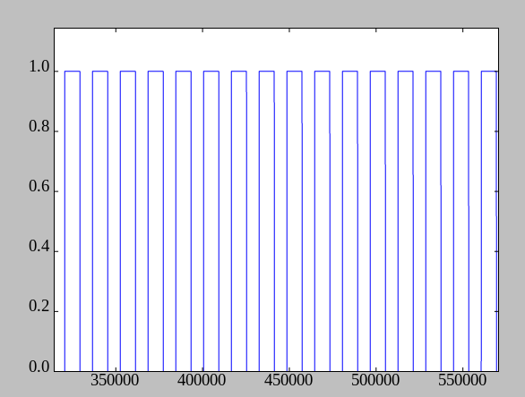
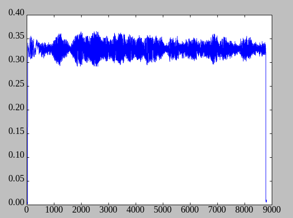
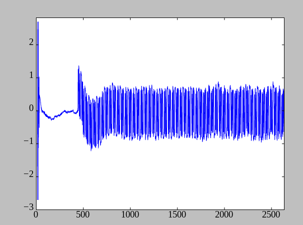
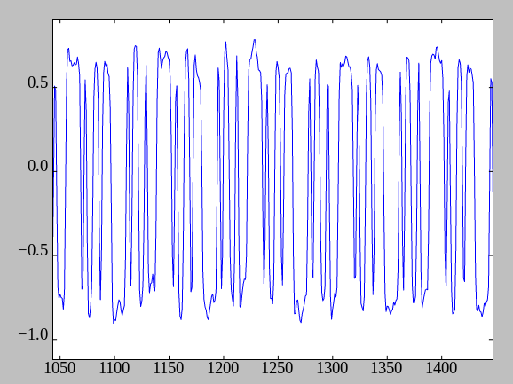

Chapter 4: Modulation
=====================

OKAY! So we're out of the classroom and back into the real world. Let's apply
what we've learned. Last time we picked up the WaveBird, we got this:


Now it's time to get my trusty HackRF One back out and capture a clip of the
WaveBird's signal to analyze it. First, I replace the ANT500 with a shorter
antenna better-suited for 2.4GHz, just to make sure I get a clean capture.

Proper sample rate for this signal
----------------------------------

We can see that the waveform is about 3-4 MHz wide. That equates to about ±2MHz
off center. We know from the Shannon-Nyquist sampling theorem that 2MHz
frequencies (either positive or negative) require sampling at 4Msamples/s. So
when we record the radio waves of the WaveBird, we know how fast we have to
sample it. (We, of course, have the option of sampling even faster, and this
helps get more precise timing. It can also help have more samples because we
can clean up the noise a bit better if we do. However, at close range, the
signal will be very strong and the extra sampling will just waste space.)

Capturing a recording to analyze
--------------------------------

Those following along at home don't necessarily need to use the HackRF One; you
can use just about any SDR frontend just as long as it can tune to the right
frequency and capture with enough bandwidth.

Since the WaveBird only transmits when giving it input, we should hold a
button. And where better to start than "start"? Also, for consistency, we
should pick a single channel to do all of this on. Channel 9 seems to be pretty
interference-free where I am, so I'll be using that.

So, with the WaveBird on, set to channel 9 (which we remember is 2438.4 MHz),
and the start button held, I point it at the HackRF One and type this command:

```
hackrf_transfer \
    -r held_start_ch9_4msps.iq `# Receive a signal, saving it to this .iq file` \
    -f 2438400000 `# Set the tuner frequency to 2438.4 MHz` \
    -a 1 -l 16 -g 10 `# Set various amps in the HackRF to get a strong signal` \
    -b 3500000 `# Set a hardware filter to remove frequencies above ~3.5 MHz,` \
               `# so we don't get any aliasing` \
    -s 4000000 `# Sample at 4 Msamples/s` \
    -n 4000000 `# Record 4M samples (i.e. 1 second)`
```

This saves to a .iq file. "IQ" is, in the signal processing world, an
abbreviation for "inphase and quadrature" - where "inphase" is whatever lines
up with the tuner, and "quadrature" is whatever is 1/4-cycle out-of-phase from that.
If this reminds you of complex numbers, that's because an IQ sample
_is exactly the same as a complex number_, and you can even use the inphase/real
and quadrature/imaginary terms interchangeably.

`hackrf_transfer` uses 8-bit signed ints for the real and imaginary components.
That means 2 bytes per sample, and the resultant file should be exactly 8MB.

Modulation
----------

Now that we have a capture to study, we need to figure out how the information
is encoded on the radio signal coming out of the WaveBird. Remember in chapter
2, when I said:

**A signal is anything that conveys information by varying over time.**

We need to figure out what Nintendo is varying to convey information.
Variations applied to a wave are called "modulations" and there's a few
different things we can modulate, so let's just look at a few modulation
schemes!

Modulation #0: Continuous wave (CW)
-----------------------------------

In continuous wave (CW) "modulation," there actually isn't any modulation.
(That's why I labeled this #0.) It's just a constant wave that's continuously
being transmitted on the channel.

No modulation means no information, so unless we're building, like, an
emergency locator beacon or something, this isn't useful.

There are a few radio operators out there who call Morse code transmission
"continuous wave" since the wave itself isn't changing at all, just being
switched on and off. But in the truest sense of the term, it's not continuous.
Sending information by turning the wave on and off is called...

Modulation #1: On-off keying (OOK)
----------------------------------

On-off keying is where you switch the transmitter on and off - either manually
as with a telegraphy key, or automatically using some kind of digital encoder -
to transmit the information you want. The data is in the timing - how long you
have the transmitter on, how long you have the transmitter off.

It's also fairly tolerant of the frequency drift problem I mentioned back in
chapter 1. Receivers typically accept a range of frequencies and consider any
wave in that range to be "on"

Because it's cheap to build an OOK transmitter, this is also a popular choice
among manufacturers of certain radio-controlled electronics (RC toys, car keys,
garage-door openers).

We also know from our spectrogram that *something* is being switched abruptly
because of those fringes so characteristic of square waves. Maybe it's OOK?
Let's build a demodulator and find out!

See the `demodulate1_ook.py` script to see how we do this. Or better yet,
run it, and we should see...!



Hm. Well... Okay, the transmitter's definitely turning on and off, but there's
no variation in the timing and spacing, so it's not likely the transmitter
switching on/off is conveying any meaningful data.

Also, these bursts are almost exactly 16,000 samples apart. With each sample
representing a 4-millionth of a second, that means these repeat every 4ms.
That's not nearly fast enough to send all ~60 bits of information in under a
frame, so it definitely can't be OOK.

Actually, what's far more likely is each of these bursts is a retransmission.
So this is not a total dead end, for we have learned something: **The WaveBird
retransmits about one ~2.2ms data packet every 4ms.**

Modulation #2: Amplitude modulation (AM)
----------------------------------------

In contrast to the black-and-white two-state modulation of OOK, amplitude
modulation allows for transmitting analog information, not by toggling the
transmitter power, but by *varying* it.

While this is great for broadcast radio or anything else sending an analog
transmission, transmitting digital information requires preagreeing on several
signal levels that expand back to sequences of bits. For example, off for '0'
and on for '1' (this is OOK above, which is actually a special case of this).
Broader sequences of bits can be transmitted too - 25% for '00', 50% for '01',
75% for '10', 100% for '11'.

This technique - using AM with specific levels to signal digital information -
is called "amplitude-shift keying" (ASK).

Let's write a demodulator and see what we can see! (`demodulate2_am.py`)



Hmm... Nope, not seeing any signal levels there, just looks like a noisy but
constant amplitude. So: not AM/ASK.

Modulation #3: Frequency modulation (FM)
----------------------------------------

This is similar to AM, but instead of changing the _power_ (amplitude) of the
signal, FM adjusts the _frequency_ (usually plus or minus several dozen KHz off
the center). As with AM, it's inherently analog, so when used to convey digital
information using prearranged frequencies, it's called "frequency-shift keying"
(FSK).

FM has some advantages over AM. For one, there's usually only one "strongest
frequency" so the FM receiver gets to ignore all of the noise below it. It's
also pretty good at keeping out interference, unless the interference
is stronger than the legitimate signal in which case the receiver will
mistake this stronger interference for the real signal and lock on to that
instead. (This is called the "capture effect.")

There are many ways to demodulate FM. We could use Fourier methods - sweep
along and do an FFT at each sample in the capture, then look for the strongest
frequency in each. However, a far faster - and easier to explain - method is to
use "delayed autocorrelation." This is where we multiply each sample by the
complex conjugate of the sample before it. As we know, the complex conjugate
simply negates the angle, and multiplying two complex numbers will add their
angles. The overall result is we get the *phase angle difference between each
pair of samples* which should correlate well to the frequency.

While this is easy to do, it's a very poor demodulator because it's very
sensitive to noise and interference, which is especially bad for a modulation
technique *known for its effectiveness against noise and interference*. Still,
when the WaveBird is held only inches away from the antenna, its signal should
be strong enough that this isn't an issue.

Now then, let's get to work and see what we can demodulate! (`demodulate3_fm.py`)



Hang on a second... That looks like something! Is that what we're after? Let's
take a closer look...



It is!!! It's our signal!!! We have an FM signal bouncing back and forth
between two frequencies. So *that's* what Nintendo's using-- two-level FSK!

FSK is a great choice against frequency drift. You can even see the frequency
drift happening in the first image, where the frequency starts out really high,
bends way down low, then bends back up to its proper frequency - presumably
whatever oscillator Nintendo uses in the WaveBird takes some warming up. But
even with all of that frequency drift happening, one FSK level is still pretty
clearly positive (above center) while the other is pretty clearly negative.

In fact, we should figure out how far apart these two frequencies are. If you
look at the extrema in the plot, they appear to be about 0.75 and -0.79. The
units are in radians per sample (after all, these are the angle differences
between consecutive samples). Multiplying that by 4,000,000 samples/sec gives
us an angular frequency of +3,000,000 and -3,160,000 radians per second. And
dividing by 2π (the number of radians in a full cycle) gives us a frequency
separation of **about ±500KHz off the center frequency**.

As for those first 400 or so samples (roughly 100μs), that appears to be
unmodulated carrier. The WaveBird probably gives its transmitter that long to
power up before it begins sending data.

Also, the repeating pattern of the signal appears to last for about 8332
samples - roughly 2083μs.

What we just did
----------------

We just applied our new-found signal processing knowledge to radio, in
particular learning about a few of the ways radio waves are modulated, and how
to demodulate them. Then we used these techniques to *find the correct way to
demodulate the WaveBird radio signals!!!*

This is actually the last chapter that's going to be on radio. As we work our
way up in abstraction and peel back the onion, we're going to get closer and
closer to the actual data. Be sure to tune in (haha) next chapter and we'll see
how to interpret the squigglies we just got.
