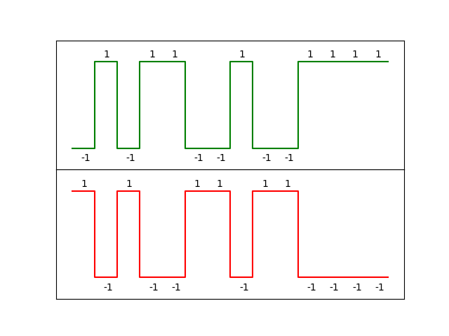

Chapter 5: Line Coding and Framing
==================================

As I mentioned in the conclusion of the last chapter, we're no longer specific
to radio here. Yes, we found a radio wave, modulated using FM/FSK. But that
FM/FSK represents concrete _analog_ levels that somehow have to be turned into the
abstract _digital_ concepts of '1' and '0'. This is done using what's called a
"line code"

While we're applying these techniques to radio, the challenge of mapping actual
physical measurements to and from abstract 1s and 0s is not specific to radio.
What we're discussing in this chapter could easily be applied to voltages on a
wire, or light pulses in a fiber optic cable, or magnetic levels on a hard
drive or tape drive, or burned pits on a CD-ROM, ...

This problem is present in any data storage or transmission technology, so
you'll find something similar in Ethernet, USB, cell phones, satellite
communications, WiFi, hard drives, bar codes, modems, and anything else that
does a digital-to-analog-to-digital conversion as part of its operation.

Line codes
----------

A very basic line code would be, "send a negative frequency/voltage/pulse to
represent '0', and send positive to represent '1' - do this at the agreed bit
rate."

This is easy, and in many circumstances works quite well, but there are a few
drawbacks.

The first is the use of the phrase "agreed bit rate" - as with frequency drift,
there will be disagreements between the sender and receiver simply because no
two clocks are created equal (unless you're working with atomic clocks).
Usually this disagreement is only a few hundredths of a percent, which is no
big deal for a single bit or a short message. But when you get into the range
of thousands of bits, that error will quickly accumulate and you'll either drop
or duplicate a few bits if you aren't careful.

To combat that problem, the receiver looks for "clues" about where the sender's
clock transitions are, then resets its clock whenever it finds such a clue.
(And some receivers even try to determine the _frequency_ difference and adjust
their local clock to match.) This is called _clock recovery_, and it works
extremely well as long as the sender leaves the receiver clues often enough to
prevent the clock error from accumulating. These "clues" are almost always state
transitions, so the line coding scheme either tries to guarantee that a given
bit cannot occur more than N times in a row, or represents bits in such a way
that there's always at least one transition on the line per bit.

The second problem with the example given is its susceptibility to _polarity
ambiguity_.  This could be a problem, for example, on a long-distance wire pair
where positive/negative voltages are used. If the wire is plugged in backwards
at the other end, the positive/negative voltages will be swapped, and the
sender's '1's will become '0's at the receiver and vice versa.

In our case, we don't have polarity ambiguity. A high frequency is very hard to
mistake for a low frequency and vice versa.

The third problem with the example above is that it's not _DC balanced_. This
is another issue that mainly affects electrical wiring, which can slowly
accumulate a charge if the signal does not average to zero volts over time.
Transmitting several '1's in a row with our simple line code will cause a
constant voltage on the wire and make a steady current flow, which could cause
a buildup of charge that impedes further voltage.

Radio doesn't have this problem either - so we really only have to look for a
line coding scheme that makes it easy for the receiver to do clock recovery.

A closer look at the WaveBird's line code
-----------------------------------------

Unfortunately, determining what line code a given device/protocol is actually
_using_ requires a fair bit of intuition. So, it's really more of an art than a
science. Basically, we're just looking at the waveform we decoded in the last
chapter and trying to figure out what pattern corresponds to a 1 and what
pattern corresponds to a 0.

The first thing to look for is any kind of repeating structure, and that's
glaringly obvious just by zooming in:


The more we look, the more we see that there are only 2 patterns in the whole
burst:



These are probably our 0s and 1s. We can't really do much besides guess here,
but let's arbitrarily call the green one '1' (because the plateau at the very
end is high) and the red one '0'. If we're wrong we can come back and change
it.

Why this sequence in particular???
----------------------------------

While I previously mentioned that a good line code leaves several breadcrumbs
for a receiver to do clock recovery, and there's obviously a *lot* of
transitions per bit with this pattern, one has to wonder: why so many
transitions?

This sequence was probably chosen for its good _autocorrelation properties_.
If you take two copies of the 14-item sequence, line them up, and multiply
together every pair, you'll get 14 +1s (because both -1 and +1 square to +1):

```
  -1  +1  -1  +1  +1  -1  -1  +1  -1  -1  +1  +1  +1  +1
x -1  +1  -1  +1  +1  -1  -1  +1  -1  -1  +1  +1  +1  +1
--------------------------------------------------------
  +1  +1  +1  +1  +1  +1  +1  +1  +1  +1  +1  +1  +1  +1 = +14
```

However, if you cycle one of the rows by any number of places, you will get
either +2 or -2 as the sum:

```
  -1  +1  -1  +1  +1  -1  -1  +1  -1  -1  +1  +1  +1  +1
x -1  -1  +1  -1  -1  +1  +1  +1  +1  -1  +1  -1  +1  +1
--------------------------------------------------------
  +1  -1  -1  -1  -1  -1  -1  +1  -1  +1  +1  -1  +1  +1 = -2
```

This is conceptually the same as a [Barker code](https://en.wikipedia.org/wiki/Barker_code),
in that this sequence will only yield a high autocorrelation sum if it is lined
up with itself *perfectly*.

This makes for *outstanding* clock recovery. It doesn't just help us keep our
clock lined up, it unambiguously tells us where the correct alignment is with
no context needed. We can just "guess and check" a given clock alignment and
we'll either get +2/-2 for "wrong alignment" or +14/-14 for '1'/'0'.

This is somewhat similar to the technique CDMA cell phones use: split every bit
into "chips", multipying the whole thing by a random "chipping code" to transmit.
The receiver takes the input and multiplies by the same (synchronized)
chipping code, which recovers the original data _and_ any interference gets
randomized away. For this reason, I'm going to call the sequence used by the
WaveBird its "chipping sequence" (and the 14 ones in the sequence are "chips").

How to decode this
------------------

Since this sequence will only correlate "perfectly" or "not at all", all we
theoretically have to do is sweep the sequence along the FM signal we got in
the last chapter and do pairwise multiplication at each point. Wherever a huge
positive number shows up in the correlation, that's a '1', and a huge negative
number is a '0'.

In practice, we'll want to ensure a certain spacing between the positive
matches in the correlation just to make sure bits don't get double-counted or
skipped (if they fall below the correlation threshold).

Either way, that's not too hard. Let's jump on over to `decode_wavebird.py` and
see how it's done!

Making sense of the output
--------------------------

The first thing we've learned is that the packets are always 200 bits long.
Since we remember from last chapter that the modulated part of the burst lasts
about 2083μs, we know the bitrate is about 96015 bits/sec. This is awfully
close to the nice round number of **96000 bits/sec** so we'll just call it
that.

We also print the mode of the decoded packets. This is the most likely to be
error-free and independent of noise from the analog sticks and shoulder
buttons. Since the length of each packet is divisible by 4, I'm switching to
hexadecimal from here on out.

To help us find common structure, I'll repeat this with far more than just the
'start' button held and print the mode of each below:

- START: **faaaaaaa1234**0002a64631175330f65e78a681a3233c23c**110**
- A btn: **faaaaaaa1234**ccc2c2ecffeb30c2c07f6a969380211ffe0**110**
- B btn: **faaaaaaa1234**4cca6242384652a0f65c689593902119fa8**110**
- A + B: **faaaaaaa1234**c44aca6c7fe330c2d16f7b979390211854b**110**
- A + X: **faaaaaaa1234**cc4a4260b2fef192c56e7b979390211f7ac**110**
- B + Y: **faaaaaaa1234**4cc2ea4aa8c74ab1e74d799482913111680**110**
- B + Z: **faaaaaaa1234**4cca6242295643a1f70839d08691711a477**110**
- A+X+Y: **faaaaaaa1234**cc40c808553bff94c01b68b593902114345**110**
- Z btn: **faaaaaaa1234**44426ac6ec4b02f1e20928d197906116382**110**

I've bolded the common structure, which has to do with the _framing_ of each
packet. Framing is what tells a receiver where a packet starts and where a
packet stops.

FAAAAAAA: The "preamble"
------------------------

The purpose of a preamble is to wake up the receiver and tell it a packet is
about to arrive. It's generally a repetitive pattern to give the receiver a
chance to get its clocks tuned and get calibrated before any actual data it
wouldn't want to miss will arrive. Nintendo (mostly) uses ...AAAA..., which, in
binary, would be ...1010101010... and makes for a nice sequence to hone in on.

Note that this is much more useful when trying to decode in real time. We have
the benefit of looking at a complete recording and carefully choosing where to
start decoding, making things like the preamble look unnecessary from our
perspective. But to a device that's trying to decode control inputs the moment
they come in, timing aids like the preamble are indespensible.

1234: The "sync word"
---------------------

Preambles are good for getting the attention of the receiver and giving it a
chance to get adjusted, but since the receiver doesn't know how much of the
preamble it missed before it acquired a fix, it won't know where the message
begins. That's why the beginning of the message is prefixed with a "sync word",
which not only clearly marks the end of the preamble, but also lets the receiver
know where the byte boundaries are.

Sync words also sometimes have another purpose: to resolve the "polarity
ambiguity" I was talking about earlier. And since `1234` makes more sense as a
human-chosen syncword than its inverse (`edcb`), it looks like we guessed our
'1' vs. '0' correctly!

Message/payload data
--------------------

No big deal here; the WaveBird just sends a fixed 140 bits of data right after
the sync word.

110: The "footer"
-----------------

Usually these are to tell the receiver that there'll be no more data, but since
the data length is fixed, this is probably here to be an expected sequence in
an expected place so the receiver knows it didn't skip or double-count a bit
somewhere.

Putting it back together again: Writing an encoder
--------------------------------------------------

Everything we have so far is, more or less, just a _guess_ about how the
WaveBird protocol works. To test that we guessed correctly, we should try
writing our own encoder and playing back some of these sequences, to see if
an authentic GameCube accepts them.

This is basically the same process as the decoder, just in reverse: We start
with a bit stream, then multiply it by the chipping sequence. The chipping
sequence is then transmitted (at 500 KHz above/below center) at a rate of
**1344000 chips/sec**, after a 100μs unmodulated carrier, then followed by
enough silence to pad the whole signal to 4ms. And then that whole thing is
transmitted on repeat with `hackrf_transfer` to see if it's accepted by the
GameCube.

The implementation is in `encode_wavebird.py` - let's go over there and see how
it's done!

Now that we have an encoder implementation, it's time to test it out. I'm going
to use the "Z held" packet from above, since there's [an easter egg that
changes the startup sound when player 1 holds Z](https://www.youtube.com/watch?v=xAXRsINhqF4)
which makes testing that the GameCube accepted the packet very easy.

First, let's sanity check it by making sure our own decoder understands it:
```
$ ./encode_wavebird.py faaaaaaa123444426ac6ec4b02f1e20928d197906116382110 reencoded_z_4msps.iq
$ ./decode_wavebird.py reencoded_z_4msps.iq 
11111010101010101010101010101010000100100011010001000100010000100110101011000110111011000100101100000010111100011110001000001001001010001101000110010111100100000110000100010110001110000010000100010000
...
11111010101010101010101010101010000100100011010001000100010000100110101011000110111011000100101100000010111100011110001000001001001010001101000110010111100100000110000100010110001110000010000100010000
-------------------------------------------------------------------------------
Mode: faaaaaaa123444426ac6ec4b02f1e20928d197906116382110 (250 times)
```

Yep. Now let's pipe it out through the HackRF to the genuine article:
```
hackrf_transfer \
    -t reencoded_z_4msps.iq `# Transmit this IQ file` \
    -f 2438400000 `# Set the tuner frequency to 2438.4 MHz` \
    -a 1 -x 16 `# Set various amps in the HackRF to get a strong signal` \
    -s 4000000 `# Sample rate is 4 Msamples/s` \
    -R `# Repeat the .iq file until interrupted`
```

With that running, we power on the GameCube and observe:
1. The easter egg version of the startup sound plays!
2. The light on the WaveBird receiver turns on!

So, this confirms it. We know how to speak WaveBird.

What we just did
----------------

We're getting closer to cracking this! We just made a decoder that can glean
'1's and '0's from a .iq capture. We also learned a bit about how Nintendo
frames the WaveBird packets.

We also made an encoder that can go back the other way, so we can do some
trial-and-error experimentation on the receiver as well. We also theoretically
have enough to make a digital repeater station, that could decode and reencode
each WaveBird packet without any noise. (Because who doesn't want to play their
_Super Mario Sunshine_ from 4 miles away?)

140 bits is still pretty large compared to our expected 60-or-so bits of actual
payload. Where are the extra 80 bits coming from? Which bits correspond to
which controller buttons? Find out in chapter 6!
